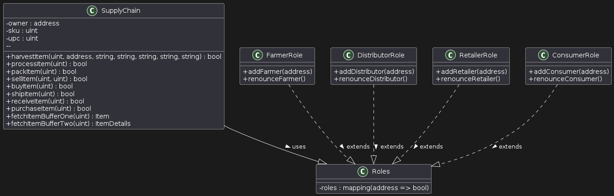

# Supply chain & data auditing

This repository containts an Ethereum DApp that demonstrates a Supply Chain flow between a Seller and Buyer. The user story is similar to any commonly used supply chain process. A Seller can add items to the inventory system stored in the blockchain. A Buyer can purchase such items from the inventory system. Additionally a Seller can mark an item as Shipped, and similarly a Buyer can mark an item as Received.

The DApp User Interface when running should look like...


## Getting Started

These instructions will get you a copy of the project up and running on your local machine for development and testing purposes. See deployment for notes on how to deploy the project on a live system.

### Prerequisites

Please make sure you've already installed ganache-cli, Truffle and enabled MetaMask extension in your browser.

```
Give examples (to be clarified)
```

### Installing

> The starter code is written for **Solidity v0.4.24**. At the time of writing, the current Truffle v5 comes with Solidity v0.5 that requires function *mutability* and *visibility* to be specified (please refer to Solidity [documentation](https://docs.soliditylang.org/en/v0.5.0/050-breaking-changes.html) for more details). To use this starter code, please run `npm i -g truffle@4.1.14` to install Truffle v4 with Solidity v0.4.24. 

A step by step series of examples that tell you have to get a development env running

Clone this repository:

```
git clone https://github.com/udacity/nd1309/tree/master/course-5/project-6
```

Change directory to ```project-6``` folder and install all requisite npm packages (as listed in ```package.json```):

```
cd project-6
npm install
```

Launch Ganache:

```
ganache-cli -m "spirit supply whale amount human item harsh scare congress discover talent hamster"
```

Your terminal should look something like this:


In a separate terminal window, Compile smart contracts:

```
truffle compile
```

Your terminal should look something like this:


This will create the smart contract artifacts in folder ```build\contracts```.

Migrate smart contracts to the locally running blockchain, ganache-cli:

```
truffle migrate
```

Your terminal should look something like this:


Test smart contracts:

```
truffle test
```

All 10 tests should pass.


In a separate terminal window, launch the DApp:

```
npm run dev
```

## Built With

* [Ethereum](https://www.ethereum.org/) - Ethereum is a decentralized platform that runs smart contracts
* [IPFS](https://ipfs.io/) - IPFS is the Distributed Web | A peer-to-peer hypermedia protocol
to make the web faster, safer, and more open.
* [Truffle Framework](http://truffleframework.com/) - Truffle is the most popular development framework for Ethereum with a mission to make your life a whole lot easier.


## Authors

See also the list of [contributors](https://github.com/your/project/contributors.md) who participated in this project.

## Acknowledgments

* Solidity
* Ganache-cli
* Truffle
* IPFS


## Requirement 1: Project write-up - UML




## Requirement 2: Project Write-up: Libraries
In this project, the following libraries are utilized, each serving specific functions within the development environment and application:

1. Lite-Server
   Purpose: Lite-server is a lightweight development server with live reload capability. It is used to serve static files such as HTML, CSS, and JavaScript, and it watches for changes in the files, automatically reloading the web page when any file is updated.
   Use in Project: This server is critical for a smooth and efficient frontend development workflow, especially when interfacing with blockchain interactions that require frequent updates to the UI components based on state changes in the smart contract.
2. Web3.js
   Purpose: Web3.js is a collection of libraries that allow you to interact with a local or remote Ethereum node using HTTP, IPC, or WebSocket. It provides the necessary tools to interact with Ethereum blockchain, deploy contracts, send transactions, and so forth.
   Use in Project: In this supply chain application, Web3.js is essential for connecting the frontend with the Ethereum blockchain. It enables the application to send transactions, call smart contract functions, and listen for events defined in the smart contracts. This interaction is pivotal for the DApp to function, allowing it to execute blockchain operations directly from the user interface.


PS C:\Users\turi\IdeaProjects\blockchain_projects\nd1309-Project-6b-Example-Template\project-6> truffle migrate --network sepolia
This version of µWS is not compatible with your Node.js build:

Error: Cannot find module '../binaries/uws_win32_x64_111.node'
Require stack:
- C:\Users\turi\AppData\Roaming\npm\node_modules\truffle\node_modules\ganache\node_modules\@trufflesuite\uws-js-unofficial\src\uws.js
- C:\Users\turi\AppData\Roaming\npm\node_modules\truffle\node_modules\ganache\dist\node\core.js
- C:\Users\turi\AppData\Roaming\npm\node_modules\truffle\build\migrate.bundled.js
- C:\Users\turi\AppData\Roaming\npm\node_modules\truffle\node_modules\original-require\index.js
- C:\Users\turi\AppData\Roaming\npm\node_modules\truffle\build\cli.bundled.js
  Falling back to a NodeJS implementation; performance may be degraded.

  

Compiling your contracts...
===========================
> Compiling .\contracts\Migrations.sol
> Compiling .\contracts\coffeeaccesscontrol\ConsumerRole.sol
> Compiling .\contracts\coffeeaccesscontrol\DistributorRole.sol
> Compiling .\contracts\coffeeaccesscontrol\FarmerRole.sol
> Compiling .\contracts\coffeeaccesscontrol\RetailerRole.sol
> Compiling .\contracts\coffeeaccesscontrol\Roles.sol
> Compiling .\contracts\coffeebase\SupplyChain.sol
> Compiling .\contracts\coffeecore\Ownable.sol
> Compilation warnings encountered:

    Warning: "selfdestruct" has been deprecated. The underlying opcode will eventually undergo breaking changes, and its use is not recommended.
--> project:/contracts/coffeebase/SupplyChain.sol:152:13:
|
152 |             selfdestruct(payable(owner));
|             ^^^^^^^^^^^^


> Artifacts written to C:\Users\turi\IdeaProjects\blockchain_projects\nd1309-Project-6b-Example-Template\project-6\build\contracts
> Compiled successfully using:
- solc: 0.8.20+commit.a1b79de6.Emscripten.clang

Migrations dry-run (simulation)
===============================
> Network name:    'sepolia-fork'
> Network id:      11155111
> Block gas limit: 30000000 (0x1c9c380)


1_initial_migration.js
======================

Deploying 'Migrations'
----------------------
> block number:        6079703
> block timestamp:     1718037003
> account:             0x9e30CF133Ae3aa49f6925a5D636BD464Cf304755
> balance:             0.299701575024492115
> gas used:            268401 (0x41871)
> gas price:           29.649727917 gwei
> value sent:          0 ETH
> total cost:          0.007958016622650717 ETH

   -------------------------------------
> Total cost:     0.007958016622650717 ETH


2_deploy_contracts.js
=====================

Deploying 'FarmerRole'
----------------------
> block number:        6079705
> block timestamp:     1718037003
> account:             0x9e30CF133Ae3aa49f6925a5D636BD464Cf304755
> balance:             0.290960259913969132
> gas used:            322613 (0x4ec35)
> gas price:           23.348760573 gwei
> value sent:          0 ETH
> total cost:          0.007532613694737249 ETH


Deploying 'DistributorRole'
---------------------------
> block number:        6079706
> block timestamp:     1718037004
> account:             0x9e30CF133Ae3aa49f6925a5D636BD464Cf304755
> balance:             0.283471016595162536
> gas used:            360082 (0x57e92)
> gas price:           20.798716178 gwei
> value sent:          0 ETH
> total cost:          0.007489243318806596 ETH


Deploying 'RetailerRole'
------------------------
> block number:        6079707
> block timestamp:     1718037005
> account:             0x9e30CF133Ae3aa49f6925a5D636BD464Cf304755
> balance:             0.276785854243950906
> gas used:            360070 (0x57e86)
> gas price:           18.566285309 gwei
> value sent:          0 ETH
> total cost:          0.00668516235121163 ETH


Deploying 'ConsumerRole'
------------------------
> block number:        6079708
> block timestamp:     1718037005
> account:             0x9e30CF133Ae3aa49f6925a5D636BD464Cf304755
> balance:             0.270806855523748702
> gas used:            360046 (0x57e6e)
> gas price:           16.606207874 gwei
> value sent:          0 ETH
> total cost:          0.005978998720202204 ETH


Deploying 'SupplyChain'
-----------------------
> block number:        6079709
> block timestamp:     1718037006
> account:             0x9e30CF133Ae3aa49f6925a5D636BD464Cf304755
> balance:             0.235558584388076623
> gas used:            2367999 (0x2421ff)
> gas price:           14.885255921 gwei
> value sent:          0 ETH
> total cost:          0.035248271135672079 ETH

   -------------------------------------
> Total cost:     0.062934289220629758 ETH

Summary
=======
> Total deployments:   6
> Final cost:          0.070892305843280475 ETH


Starting migrations...
======================
> Network name:    'sepolia'
> Network id:      11155111
> Block gas limit: 30000000 (0x1c9c380)


1_initial_migration.js
======================

Deploying 'Migrations'
----------------------
> transaction hash:    0x882164d3ac918bc529da461ebcca496bd118dd1353f408d1ab325157bdd4615e
> Blocks: 1            Seconds: 12
> contract address:    0x7F8ae8c406306771129B7Df54b0bfA0D774F1201
> block number:        6079709
> block timestamp:     1718037024
> account:             0x9e30CF133Ae3aa49f6925a5D636BD464Cf304755
> balance:             0.299919694010903371
> gas used:            268401 (0x41871)
> gas price:           28.837067061 gwei
> value sent:          0 ETH
> total cost:          0.007739897636239461 ETH

> Saving migration to chain.
> Saving artifacts
   -------------------------------------
> Total cost:     0.007739897636239461 ETH


2_deploy_contracts.js
=====================

Deploying 'SupplyChain'
-----------------------
> transaction hash:    0xdf8edc1001f037a3c0ab885e69a985290e9a099129125a19a0a48cd7ccf5c1f9
> Blocks: 0            Seconds: 12
> contract address:    0xb62976385b852CaA3f14120C84bb50d331100FE4
> block number:        6079747
> block timestamp:     1718037540
> account:             0x9e30CF133Ae3aa49f6925a5D636BD464Cf304755
> balance:             0.217215120706079383
> gas used:            2367999 (0x2421ff)
> gas price:           26.737922544 gwei
> value sent:          0 ETH
> total cost:          0.063315373846269456 ETH

Deploying 'FarmerRole'
----------------------
> transaction hash:    0x33fc67ecfbac538205731454d4b950a4f5a21211992a76f26270c1bdd9ec331b
> Blocks: 0            Seconds: 8
> contract address:    0xa649B181ccaf30E558280f8DCFf0E4139B4018e3
> block number:        6079711
> block timestamp:     1718037048
> account:             0x9e30CF133Ae3aa49f6925a5D636BD464Cf304755
> balance:             0.288838113497800765
> gas used:            322613 (0x4ec35)
> gas price:           30.167910123 gwei
> value sent:          0 ETH
> total cost:          0.009732559988511399 ETH
> 
> 
> > Compiled successfully using:
- solc: 0.8.20+commit.a1b79de6.Emscripten.clang


Migrations dry-run (simulation)
===============================
> Network name:    'sepolia-fork'
> Network id:      11155111
> Block gas limit: 30000000 (0x1c9c380)


2_deploy_contracts.js
=====================

Deploying 'SupplyChain'
-----------------------
> block number:        6080818
> block timestamp:     1718050723
> account:             0x9e30CF133Ae3aa49f6925a5D636BD464Cf304755
> balance:             0.206430030730104047
> gas used:            3328747 (0x32caeb)
> gas price:           3.239984888 gwei
> value sent:          0 ETH
> total cost:          0.010785089975975336 ETH

   -------------------------------------
> Total cost:     0.010785089975975336 ETH

Summary
=======
> Total deployments:   1
> Final cost:          0.010785089975975336 ETH


Starting migrations...
======================
> Network name:    'sepolia'
> Network id:      11155111
> Block gas limit: 30000000 (0x1c9c380)


2_deploy_contracts.js
=====================

Deploying 'SupplyChain'
-----------------------
> transaction hash:    0x2a2d496ac4d32f4cb3aca5e85b32823508c67f19c77f066030ed4324e2737f6d
> Blocks: 0            Seconds: 12
> contract address:    0x27F7E8A43750802C825C86f46cb8c0C7B97172d4
> block number:        6080823
> block timestamp:     1718050740
> account:             0x9e30CF133Ae3aa49f6925a5D636BD464Cf304755
> balance:             0.206247007635205534
> gas used:            3328747 (0x32caeb)
> gas price:           3.294967467 gwei
> value sent:          0 ETH
> total cost:          0.010968113070873849 ETH

> Saving migration to chain.
> Saving artifacts
   -------------------------------------
> Total cost:     0.010968113070873849 ETH

Summary
=======
> Total deployments:   1
> Final cost:          0.010968113070873849 ETH
